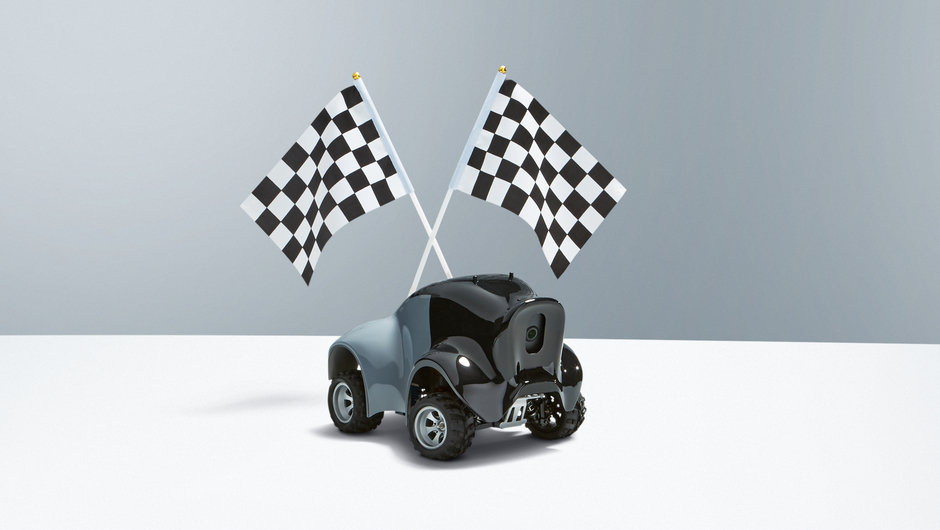
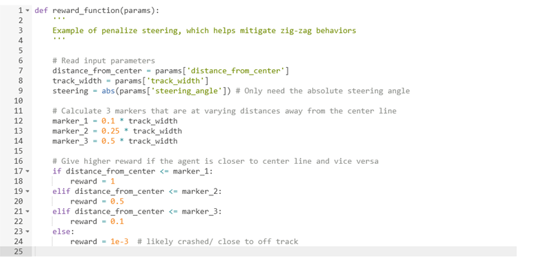
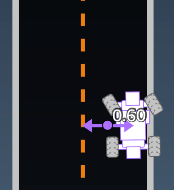

## AWS DeepRacer Project
##### **BY JENNY**
[[1]]
Program a model or an instruction for the car to run on a specific track(including Oval track; H track; Straight track) in a simulated or real environment.
### ***Simper Version of the AWS DeepRacer Reward System*** 
------
The reward function is an algorithm of a model which guides the vehicles to perform favorably through using the positive or negative numbers to indicate whether the action performed resulted in:
* A higher postive number-A good outcome
* A Smaller positive number/negative number-A bad outcome

For example, the reward function is constructed to keep the vehicle close to the centerline of the track, ensuring they are not running towards the edge of the track.[[2]] 
The reward function is achieved by using Python.[[3]]
 [[4]] 

>As demonstrated in the illustration, if the distance of the vehicle from the centerline is <= 0.1 times the track width, then 1 mark will be granted; if the distance of the vehicle from the centerline is > 3 times the track width, then 0.001 marks will be given. (Marks will accumulate.) The vehicle will then adjust and refine its performance until it achieves a final high score.

[5]

>Displacement, in meters, between the vehicle center and the track center.
The reward function incents and encourages the vehicle to travel safely and speedily to the destination.[[3]]

[1]:https://itbrief.com.au/story/aws-offers-devs-tiny-autonomous-vehicles-for-machine-learning
[2]:https://docs.aws.amazon.com/en_pv/deepracer/latest/developerguide/deepracer-how-it-works-action-space.html
[3]:https://docs.aws.amazon.com/en_pv/deepracer/latest/developerguide/deepracer-basic-concept.html
[4]:https://docs.aws.amazon.com/en_pv/deepracer/latest/developerguide/deepracer-console-train-evaluate-models.html
[5]:https://docs.aws.amazon.com/en_pv/deepracer/latest/developerguide/deepracer-reward-function-input.html 
### ***References***
------
AWS 2019, AWS DeepRacer Basic Concepts and Terminology, viewed 24 November 2019,https://docs.aws.amazon.com/en_pv/deepracer/latest/developerguide/deepracer-basic-concept.html.

AWS 2019, AWS DeepRacer Action Space and Reward Function, viewed 24 November 2019, https://docs.aws.amazon.com/en_pv/deepracer/latest/developerguide/deepracer-how-it-works-action-space.html.

***Image:***

https://itbrief.com.au/story/aws-offers-devs-tiny-autonomous-vehicles-for-machine-learning
https://docs.aws.amazon.com/en_pv/deepracer/latest/developerguide/deepracer-console-train-evaluate-models.html
https://docs.aws.amazon.com/en_pv/deepracer/latest/developerguide/deepracer-reward-function-input.html

