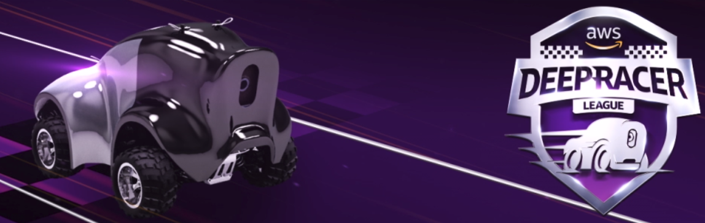

## AWS DeepRacer Project

>Program a model or an instruction for the car to perform on a specific track(including Oval track; H track; Straight track) in a simulated or real environment.
###### AWS DeepRacer Reward System 
------
Reward function is an algorithm of a model which guides the vehicles to perform in a favourable way through using the positive or negative numbers to indicate whether the action performed resulted in:
* A good outcome
* A bad outcome 
For example, the reward function is constructed to keep the vehicle close to the center line of the track, ensuring them are not runnning towards the edge of the track. 
The reward function is achieved by using Python, as demonstrate below.

